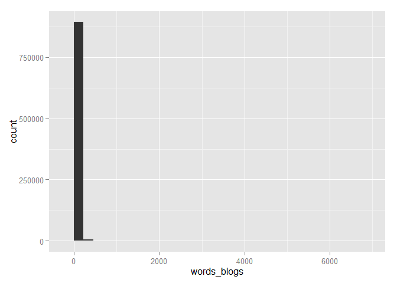
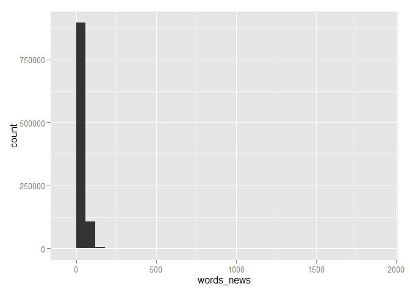
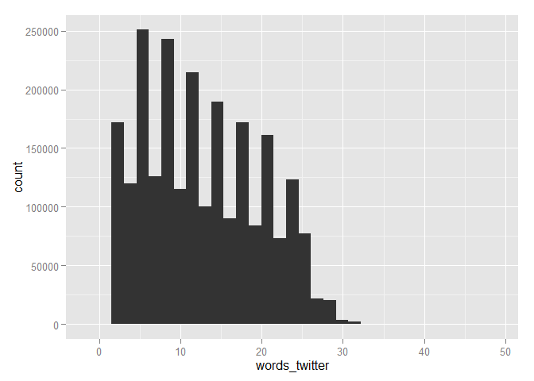

# Online Text Exploration
Bastiaan Quast  
Monday, November 10, 2014  

# Abstract
We analyse three corpora of US English text found online.
We find that the **blogs** and **news** corpora are similar,
the **twitter** corpus is different.
We propose that this is the result of the 140 character limit of Twitter messages.

# Introduction
In this report we look at three corpora of US English text, a set of internet blogs posts, a set of internet news articles, and a set of twitter messages.

We collect the following forms of information:

 1. file size
 2. number of lines
 3. number of non-empty lines
 4. number of words
 5. distribution of words (quantiles and plot)
 6. number of characters
 7. number of non-white characters
 
In the following section we will describe the data collection process,
the section after that gives the results of the data exploration,
we finally present conclusions and give references.

For our analysis we use the R computing environment [@R], as well as the libraries **stringi** [@stringi] and **ggplot2** [@ggplot2].
In order to make the code more readable we use the pipe operator from the **magrittr** library [@magrittr].
This report is compiled using the **rmarkdown ** library [@rmarkdown].
Finally during writing we used the RStudio IDE [@RStudio].

# Data

The data is presented as a [ZIP compressed archive](http://en.wikipedia.org/wiki/Zip_(file_format)), which is freely downloadable from [here](https://d396qusza40orc.cloudfront.net/dsscapstone/dataset/Coursera-SwiftKey.zip).

```r
# specify the source and destination of the download
destination_file <- "Coursera-SwiftKey.zip"
source_file <- "http://d396qusza40orc.cloudfront.net/dsscapstone/dataset/Coursera-SwiftKey.zip"

# execute the download
download.file(source_file, destination_file)

# extract the files from the zip file
unzip(destination_file)
```

Inspect the unzipped files

```r
# find out which files where unzipped
unzip(destination_file, list = TRUE )
```

```
##                             Name    Length                Date
## 1                         final/         0 2014-07-22 10:10:00
## 2                   final/de_DE/         0 2014-07-22 10:10:00
## 3  final/de_DE/de_DE.twitter.txt  75578341 2014-07-22 10:11:00
## 4    final/de_DE/de_DE.blogs.txt  85459666 2014-07-22 10:11:00
## 5     final/de_DE/de_DE.news.txt  95591959 2014-07-22 10:11:00
## 6                   final/ru_RU/         0 2014-07-22 10:10:00
## 7    final/ru_RU/ru_RU.blogs.txt 116855835 2014-07-22 10:12:00
## 8     final/ru_RU/ru_RU.news.txt 118996424 2014-07-22 10:12:00
## 9  final/ru_RU/ru_RU.twitter.txt 105182346 2014-07-22 10:12:00
## 10                  final/en_US/         0 2014-07-22 10:10:00
## 11 final/en_US/en_US.twitter.txt 167105338 2014-07-22 10:12:00
## 12    final/en_US/en_US.news.txt 205811889 2014-07-22 10:13:00
## 13   final/en_US/en_US.blogs.txt 210160014 2014-07-22 10:13:00
## 14                  final/fi_FI/         0 2014-07-22 10:10:00
## 15    final/fi_FI/fi_FI.news.txt  94234350 2014-07-22 10:11:00
## 16   final/fi_FI/fi_FI.blogs.txt 108503595 2014-07-22 10:12:00
## 17 final/fi_FI/fi_FI.twitter.txt  25331142 2014-07-22 10:10:00
```

```r
# inspect the data
list.files("final")
```

```
## [1] "de_DE" "en_US" "fi_FI" "ru_RU"
```

```r
list.files("final/en_US")
```

```
## [1] "en_US.blogs.txt"   "en_US.news.txt"    "en_US.twitter.txt"
```

The corpora are contained in three separate plain-text files,
out of which one is binary, for more information on this see [@newtest].
We import these files as follows.

```r
# import the blogs and twitter datasets in text mode
blogs <- readLines("final/en_US/en_US.blogs.txt", encoding="UTF-8")
twitter <- readLines("final/en_US/en_US.twitter.txt", encoding="UTF-8")
```

```
## Warning in readLines("final/en_US/en_US.twitter.txt", encoding = "UTF-8"):
## line 167155 appears to contain an embedded nul
```

```
## Warning in readLines("final/en_US/en_US.twitter.txt", encoding = "UTF-8"):
## line 268547 appears to contain an embedded nul
```

```
## Warning in readLines("final/en_US/en_US.twitter.txt", encoding = "UTF-8"):
## line 1274086 appears to contain an embedded nul
```

```
## Warning in readLines("final/en_US/en_US.twitter.txt", encoding = "UTF-8"):
## line 1759032 appears to contain an embedded nul
```

```r
# import the news dataset in binary mode
con <- file("final/en_US/en_US.news.txt", open="rb")
news <- readLines(con, encoding="UTF-8")
close(con)
rm(con)
```

Full instructions for importing the data can be found in the [CodeBook](https://github.com/bquast/Data-Science-Capstone/blob/master/CodeBook.md) of the [GitHub repository](https://github.com/bquast/Data-Science-Capstone).


# Basic Statistics

The before we analyse the files we look at their size (presented in MegaBytes / MBs).

```r
# file size (in MegaBytes/MB)
file.info("final/en_US/en_US.blogs.txt")$size   / 1024^2
```

```
## [1] 200.4242
```

```r
file.info("final/en_US/en_US.news.txt")$size    / 1024^2
```

```
## [1] 196.2775
```

```r
file.info("final/en_US/en_US.twitter.txt")$size / 1024^2
```

```
## [1] 159.3641
```

For our analysis we need two libraries.

```r
# library for character string analysis
library(stringi)

# library for plotting
library(ggplot2)
```

We analyse the lines and characters.

```r
stri_stats_general( blogs )
```

```
##       Lines LinesNEmpty       Chars CharsNWhite 
##      899288      899288   206824382   170389539
```

```r
stri_stats_general( news )
```

```
##       Lines LinesNEmpty       Chars CharsNWhite 
##     1010242     1010242   203223154   169860866
```

```r
stri_stats_general( twitter )
```

```
##       Lines LinesNEmpty       Chars CharsNWhite 
##     2360148     2360148   162096031   134082634
```

Next we count the words per item (line). We summarise the distibution of these counts per corpus, using summary statistics and a distibution plot. we start with the **blogs** corpus.

```r
words_blogs   <- stri_count_words(blogs)
summary( words_blogs )
```

```
##    Min. 1st Qu.  Median    Mean 3rd Qu.    Max. 
##    0.00    9.00   28.00   41.75   60.00 6726.00
```

```r
qplot(   words_blogs )
```

```
## stat_bin: binwidth defaulted to range/30. Use 'binwidth = x' to adjust this.
```

 

Next we analys the **news** corpus.

```r
words_news    <- stri_count_words(news)
summary( words_news )
```

```
##    Min. 1st Qu.  Median    Mean 3rd Qu.    Max. 
##    1.00   19.00   32.00   34.41   46.00 1796.00
```

```r
qplot(   words_news )
```

```
## stat_bin: binwidth defaulted to range/30. Use 'binwidth = x' to adjust this.
```

 

Finally we analyse the **twitter** corpus.

```r
words_twitter <- stri_count_words(twitter)
summary( words_twitter )
```

```
##    Min. 1st Qu.  Median    Mean 3rd Qu.    Max. 
##    1.00    7.00   12.00   12.75   18.00   47.00
```

```r
qplot(   words_twitter )
```

```
## stat_bin: binwidth defaulted to range/30. Use 'binwidth = x' to adjust this.
```

 

# Conclusions
We analyse three corpora of US english text. The file sizes are around 200 MegaBytes (MBs) per file.

We find that the **blogs** and **news** corpora consist of about 1 million items each,
and the *twitter** corpus consist of over 2 million items.
Twitter messages have a character limit of 140 (with exceptions for links),
this explains why there are some many more items for a corpus of about the same size.

This result is further supported by the fact that the number of characters is similar for all three corpora (around 200 million each).

Finally we find that the frequency distributions of the **blogs** and **news ** corpora are similar (appearing to be log-normal).
The frequency distribution of the **twitter** corpus is again different, as a result of the character limit.


# References
